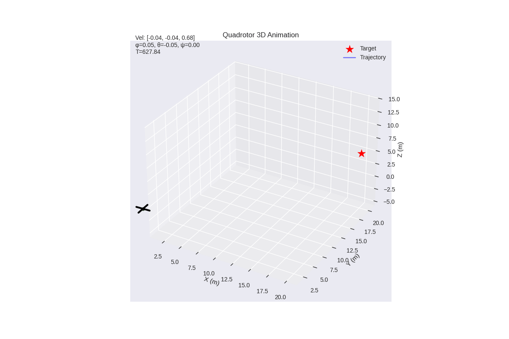
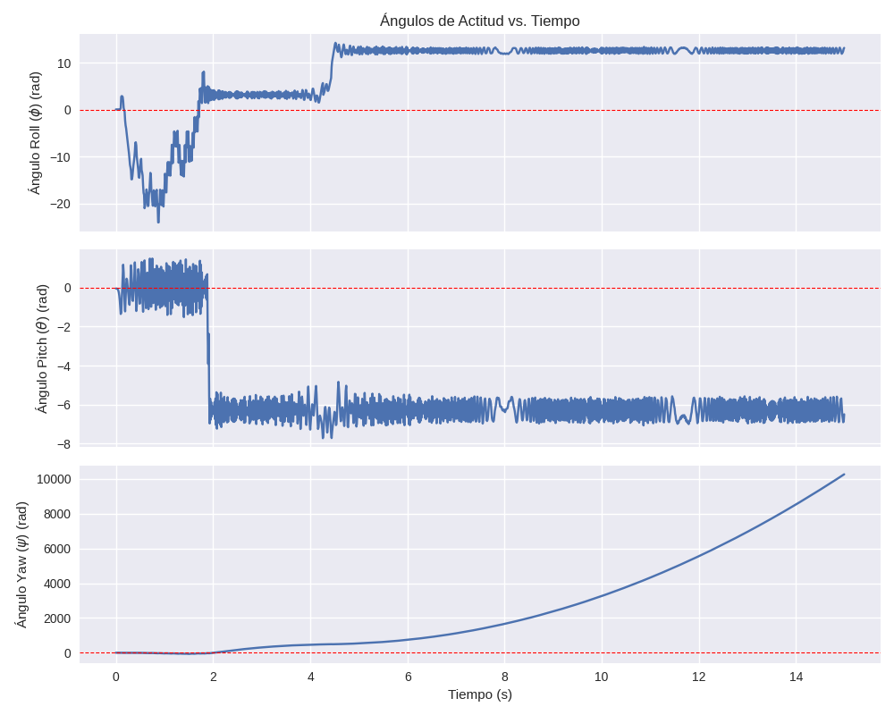

# Simulación y Control de un Dron Quadrotor (UAV)

Mi proyecto presenta el desarrollo de un sistema de control de vuelo de 
un quadrotor capaz de completar circuitos de navegación. 

> ## Motivación
> El objetivo era desarrollar un Sistema Dinámico en la asignatura Modelos Computacionales y Simulación de Sistemas. Dado que en Razonamiento y Representación del Conocimiento diseñamos un Robot Móvil, y además, de pequeño me gustaba la serie *Hover Champions* opté por crear un **Dron** capaz de recorrer un circuito prediseñado.

El objetivo principal ha sido el desarrollo de un sistema dinámico universal capaz de estabilizar y guiar diversas configuraciones de drones. Es decir, nos hemos centrado en la escalabilidad y versatilidad, permitiendo que distintos modelos físicos alcancen resultados óptimos de navegación, sin centrarnos en el diseño de un prototipo único.


## Demostración del Vuelo

*Animación 3D del dron ejecutando el circuito de waypoints definido.*



---

## Ingeniería del Sistema

### Control en Cascada (PD)

El dron utiliza una arquitectura de control en cascada para separar la navegación de la estabilidad:

* **Bucle de Posición:** Traduce la distancia al objetivo en ángulos de inclinación deseados.
* **Bucle de Actitud:** Ejecuta correcciones de torque a alta frecuencia para mantener el equilibrio, escaladas dinámicamente según la **Inercia** del modelo.

### Física y Realismo Aerodinámico

A diferencia de simulaciones básicas, este modelo incluye:

* **Resistencia al Aire ($k_{drag}$):** Modelada en los tres ejes para limitar velocidades irreales y permitir el cálculo de velocidades terminales.
* **Dinámica Escalable:** El controlador detecta automáticamente el tamaño del dron ($L$) y ajusta su fuerza de giro para evitar oscilaciones en drones pequeños.

---

## Análisis de Rendimiento

Validamos el sistema mediante telemetría para asegurar que, independientemente de la configuración, el comportamiento converge al objetivo:

*Las líneas verdes indican el éxito en la transición de waypoints, demostrando la precisión del seguimiento de ruta.*



## Cómo Ejecutar el código

1. **Define tu circuito:** Edita la lista `self.waypoints` en `main.py`.
2. **Configura el dron:** Ajusta la longitud del brazo ($L$) en la clase `Drone`.
3. **Lanza el vuelo:**

```bash
python3 app/main.py
```
